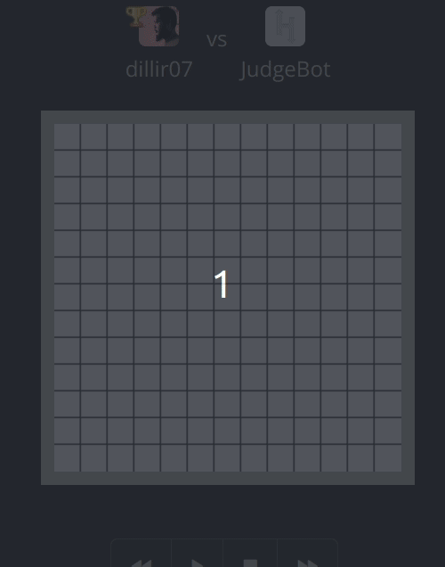
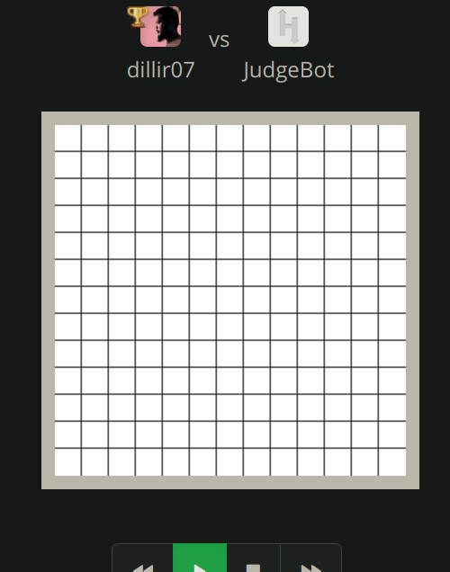
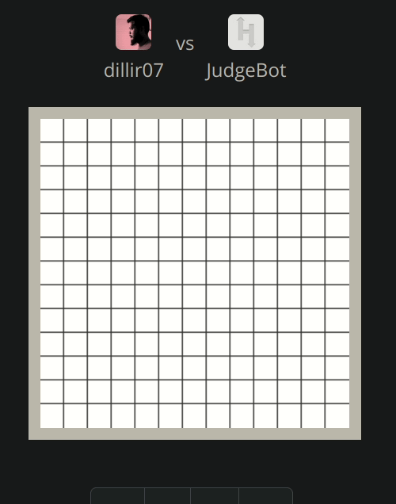

# Tron Game

Tron is a two player game based on the popular movie Tron. The objective of the game is to cut off players movement through each others motorbikes that leave a wall behind them as they move.

## Note:
There are better approaches to this problem, this is one of the simple approach which got about 36 score out of 50.

Easy Win 

Win

Tie

There are other scenarios, where this approach may not win.

ref: https://www.hackerrank.com/challenges/tron?hr_b=1